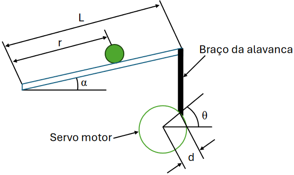
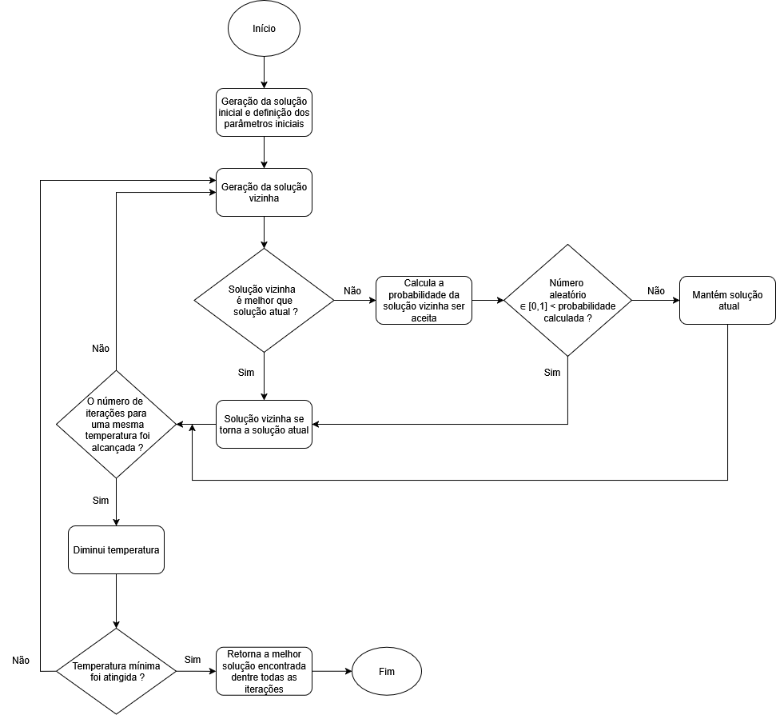
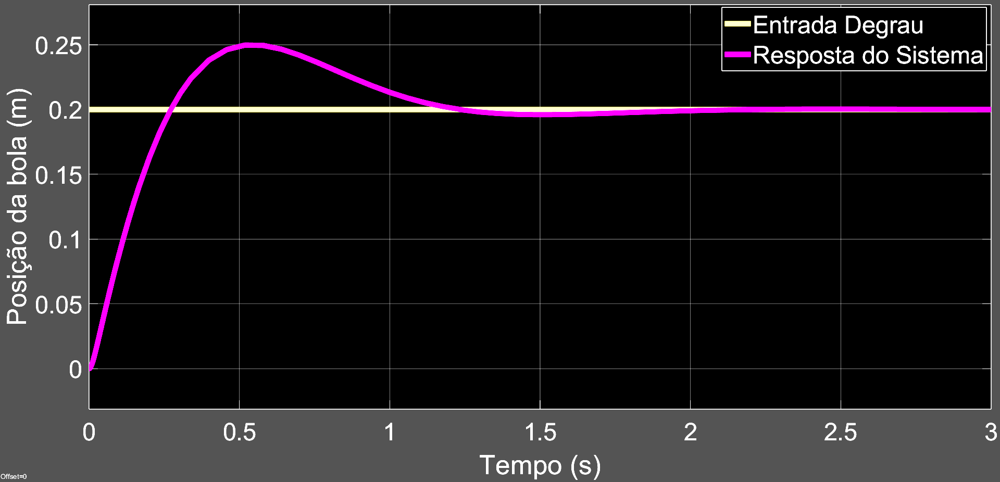
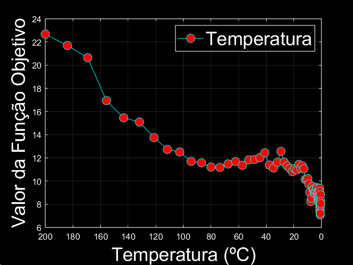

# Otimização por Simulated Annealing (MATLAB)

Este projeto apresenta uma implementação em MATLAB do algoritmo **Simulated Annealing** (Recozimento Simulado), uma meta-heurística poderosa utilizada para a exploração de espaços de busca complexos e identificação de ótimos globais.

## 🧠 Sobre o Algoritmo
O Simulated Annealing simula o processo físico de recozimento de materiais para encontrar o estado de energia mínima. A grande vantagem desta técnica é a sua capacidade de aceitar, de forma probabilística, soluções piores no início do processo. Isso permite que o algoritmo escape de **ótimos locais**, aumentando as chances de encontrar a melhor solução possível (o ótimo global) para problemas de otimização.

## ⚙️ Parâmetros de Configuração
A eficácia da busca pode ser ajustada através dos seguintes hiperparâmetros definidos no código:

* **Temperatura Inicial:** Define a probabilidade inicial de aceitar soluções desfavoráveis.
* **Taxa de Resfriamento:** Controla a velocidade de redução da temperatura.
* **Critério de Parada:** Define quando a busca termina (seja por temperatura mínima atingida ou número total de iterações).
* **Geração de Vizinhos:** A lógica utilizada para explorar pequenas variações na solução atual.

## 📊 Visualização
Ao ser executado, o algoritmo produz gráficos de convergência que permitem analisar o comportamento da função objetivo em relação ao decaimento da temperatura, facilitando o ajuste fino dos parâmetros para diferentes tipos de problemas.

## Funcionamento do algoritmo

Neste projeto foi estudado a otimização de um sistema mecânico didático denominado Ball and Beam (Bola Viga), para o controle do sistema foi empregado o controlador Proporcional-Integral-Derivativo (PID) sendo que, os parâmetros do PID foram sintonizados e otimizados pela metaheurística Simulated Annealing (SA).

Abaixo está a representação adotada do sistema Ball and Beam para o desenvolvimento do projeto.

O SA é um algoritmo probabilístico proposto por Kirkpatrick, Gelatt e Vecchi (1983) que, em sua concepção foi baseado nos princípios da termodinâmica, no qual busca simular o resfriamento da matéria, de forma lenta, após essa ser aquecida. A analogia do SA com o recozimento de metais é muito direta. A função objetivo que é utilizada para calcular o desempenho da solução inicial e da solução vizinha, na analogia do algoritmo com a termodinâmica ela substitui a energia, com isso, nos vários espaços de busca as possíveis soluções a serem encontradas se configuram como sendo os vários estados da matéria. Ademais, os mínimos ótimos locais que a função objetivo encontra são os estados metaestáveis da matéria e por fim, o cristal que é resfriado no processo de annealing é o ótimo global.

A seguir é visualizado o fluxograma do algoritmo do SA desenvolvido.

Os resultados obtidos evidenciaram que o algoritmo propos uma ação de controle rápida e satisfatória para o sistema Ball and Beam, conseguindo encontrar a melhor resposta global. A seguir é visualizado os resultados.

